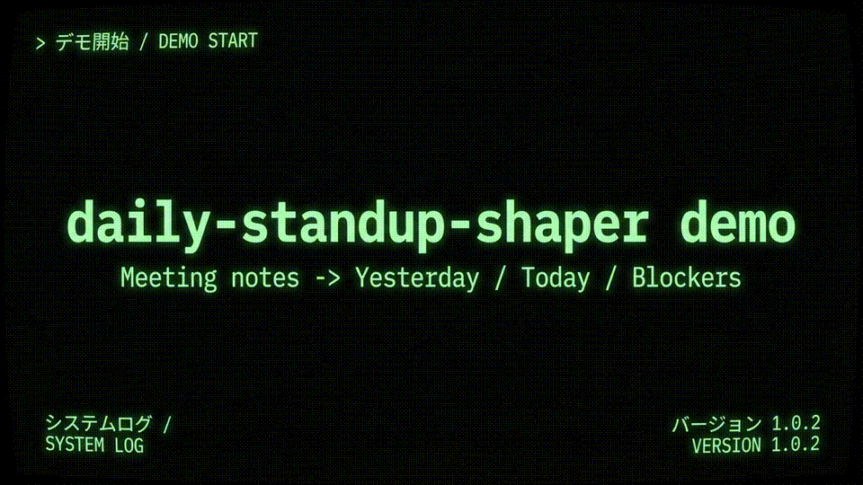

# daily-standup-shaper

会議メモの箇条書きを、朝会共有用の3ブロック（Yesterday / Today / Blockers）に整形するミニCLI。

## Why now (2026-02-23)
既存テーマが「会議クローズ後の整理」中心だったため、**朝会の直前整形**に特化した当日新規テーマとして開始。

## MVP
- 入力: プレーンテキスト（複数行）
- 出力: Markdownで以下3見出しを生成
  - Yesterday
  - Today
  - Blockers

## Demo video
`nano-banana-pro` で生成したデモフレームをもとに作成した簡易デモ動画です。



- MP4: `./assets/demo/daily-standup-shaper-demo.mp4`
- GIF: `./assets/demo/daily-standup-shaper-demo.gif`

## Implemented
- 入力パターンを3系統追加（日本語ラベル / Englishラベル / Done-Plan-Risk）
- 抽出失敗時のフォールバック文言を実装
- `examples/patterns.txt` に Pattern D（ラベル直下の複数箇条書き）を追加
- 箇条書き連結の自動テスト `scripts/selfcheck.sh` を追加
- `--format json` を追加（singleはオブジェクト、`--all` は配列）
- `--strict` を追加（未抽出項目がある場合に非0終了）
- `--quiet` を追加（strict失敗時の警告を抑制して出力のみ保持）
- `--json-keys` を追加（json出力キー名を `done,plan,impediments` などに変更可能）
- `--no-entry-header` を追加（`--all` のMarkdown出力で `### Entry N` 見出しを省略可能）
- `Name:` / `名前:` がある段落では `### Entry N (名前)` として見出しに反映
- `scripts/selfcheck.sh` に `--labels` カスタムファイル読み込みテストを追加
- `--labels` のJSON検証を追加（必須キー欠落・型不正を明示エラー化）
- `--json-include-entry-meta` を追加（`--all --format json` で `entryIndex` / `entryName` を付与可能）
- selfcheck PASS を確認（`./scripts/selfcheck.sh`）
- `./scripts/selfcheck.sh --summary` を追加（CI向け1行サマリ: passed/failed_case）

## Pattern D (multiline bullets)
以下のような入力を 1 項目に連結して出力します。

```text
昨日:
- APIモック作成
- 認可テスト追加
```

出力（Yesterday）:

```text
- APIモック作成 / 認可テスト追加
```

## Quick check
```bash
./scripts/selfcheck.sh

# README/スナップショット同期（help/options + one-line contract + links + recommended + sync-line + summary-line + failure-heading/template + help-examples + optional-order を1コマンドで揃える）
./scripts/sync-help-to-readme.sh --all
# 失敗時はこの2行テンプレで復旧/確認
# retry: ./scripts/sync-help-to-readme.sh --all
# diff: git diff -- README.md tests/snapshots

# 必要時のみ: 個別同期（推奨順で実行）
# 個別同期7コマンドの順序スナップショットだけを1コマンドで復旧
./scripts/sync-help-to-readme.sh --update-sync-help-optional-order-snapshot
# 1) 推奨順1行スナップショットだけ更新
./scripts/sync-help-to-readme.sh --update-recommended-sequence-snapshot
# 2) sync-help単体行スナップショットだけ更新
./scripts/sync-help-to-readme.sh --update-sync-line-snapshot
# 3) summary単体行スナップショットだけ更新（READMEを1ソース化）
./scripts/sync-help-to-readme.sh --update-summary-line-snapshot
# 4) sync-help失敗時見出し1行のスナップショットを更新
./scripts/sync-help-to-readme.sh --update-sync-help-failure-heading-snapshot
# 5) sync-help失敗時2行テンプレのスナップショットを更新
./scripts/sync-help-to-readme.sh --update-sync-help-failure-template-snapshot
# 6) test-links だけ個別同期（--help Examples と同一手順）
./scripts/sync-help-to-readme.sh --update-one-line-contract-test-links
# 7) --help Examples ブロック最小スナップショット更新（help/README二重編集差分を検知）
./scripts/sync-help-to-readme.sh --update-help-examples-snapshot

# ローカル検証ワンライナー（同期→summary、直後のCI向け1行サマリと同順）
./scripts/sync-help-to-readme.sh --all && ./scripts/selfcheck.sh --summary
./scripts/selfcheck.sh --summary

# 最小CI例（grep -E 1本で summary 契約を検証）
./scripts/selfcheck.sh --summary | grep -E '^SELF_CHECK_SUMMARY: passed=[0-9]+/[0-9]+ failed_case=(none|[a-z0-9._-]+)$'

# failed_case の命名規約: [a-z0-9._-]+ のみを許容
# 理由: grep -E / POSIX sh / GitHub Actions log 上で追加エスケープなしに安全に抽出・再利用でき、
# triage時に "どのケースが落ちたか" を機械判定で一意に追跡しやすくするため。
# 運用では lower_snake / kebab / dot 区切りを使い、空白や日本語、記号（: , / など）は使わない。
# 命名テンプレ: SELF_CHECK_FORCE_FAIL_CASE=summary-fail.case_name ./scripts/selfcheck.sh --summary
# 正常系の最小例（NG例との対比用）: SELF_CHECK_FORCE_FAIL_CASE=foo-1 ./scripts/selfcheck.sh --summary
# 許容境界（先頭/末尾）: '.' '-' '_' は保持される（例: '.case', 'case-', '_case_'）。
# 境界対比（3点セット）: `0foo` は許容 / `Foo` は拒否 / `fooA` は拒否（英大文字は先頭・末尾とも規約外）。
# 最小再現（NG文字種の対比）: SELF_CHECK_FORCE_FAIL_CASE=fooA ./scripts/selfcheck.sh --summary && SELF_CHECK_FORCE_FAIL_CASE='foo/bar' ./scripts/selfcheck.sh --summary
# 拒否境界（抽出NG例）: ')foo' / 'foo)' は failed_case として抽出されない（先頭/末尾の ')' は規約外）。
# extract_failed_case_from_summary_line も同じ許容境界で抽出し、境界文字を削らずに返す。
<a id="quick-check-one-line-acceptance"></a>
# 受け入れ条件（1行）: failed_case は `[a-z0-9._-]+` を満たし、`0foo` は許容・`Foo`/`fooA`/`foo/bar` は拒否（英大文字・スラッシュは全位置で規約外）。契約詳細は [Strict mode (CI向け)](#strict-mode-ci向け) / [Quiet mode](#quiet-mode) を参照。
# 対応テスト: [`accepts 0foo (README one-line acceptance)`](./scripts/selfcheck.sh#L1024), [`rejects Foo (README one-line acceptance)`](./scripts/selfcheck.sh#L1025), [`rejects fooA (uppercase suffix, README one-line acceptance)`](./scripts/selfcheck.sh#L1025), [`rejects foo/bar (slash delimiter, README one-line acceptance)`](./scripts/selfcheck.sh#L1025)
# 補足: 上記4リンクは selfcheck 内の「README one-line acceptance」境界テスト群（0foo許容 / Foo・fooA・foo/bar拒否）を指す。
# 2行契約ブロックスナップショット更新: ./scripts/update-one-line-contract-snapshot.sh
# 対応テスト4リンク行の同期（README行番号ズレ防止）: ./scripts/update-one-line-contract-test-links.sh
# test-links スナップショット差分の復旧（README行 + tests/snapshots/readme-quick-check-one-line-contract-links.md を同時更新）:
#   ./scripts/update-one-line-contract-test-links.sh
#   git diff -- README.md tests/snapshots/readme-quick-check-one-line-contract-links.md
# SELF_CHECK_FORCE_FAIL_CASE に空白など規約外文字を渡した場合は、
# failed_case=invalid-self-check-force-fail-case で明示的に拒否される。

# jq 非依存の POSIX sh 例（summary行の形式 + passed 分子/分母整合）
summary_line=$(./scripts/selfcheck.sh --summary)
case "$summary_line" in
  SELF_CHECK_SUMMARY:\ passed=*/*\ failed_case=none|SELF_CHECK_SUMMARY:\ passed=*/*\ failed_case=[a-z0-9._-]*) ;;
  *) echo "FAIL: invalid summary format: $summary_line" >&2; exit 1 ;;
esac
passed_pair=${summary_line#SELF_CHECK_SUMMARY: passed=}
passed_pair=${passed_pair%% failed_case=*}
passed_ok=${passed_pair%%/*}
passed_all=${passed_pair#*/}
[ "$passed_ok" = "$passed_all" ] || {
  echo "FAIL: passed mismatch: $passed_ok/$passed_all" >&2
  exit 1
}

# --summary 失敗例（期待: 先頭1行が SUMMARY / 終了コードは非0）
set +e
SELF_CHECK_FORCE_FAIL_CASE=summary-failcase-contract-sentinel \
SELF_CHECK_SKIP_SUMMARY_FAILCASE_TEST=1 \
./scripts/selfcheck.sh --summary > /tmp/dss-summary-fail.out
code=$?
set -e
head -n 1 /tmp/dss-summary-fail.out  # SELF_CHECK_SUMMARY: passed=<n>/<m> failed_case=summary-failcase-contract-sentinel
[ "$code" -ne 0 ] && echo "PASS: summary failure contract"
```

受け入れ条件（summary失敗ログの固定形式）:
- `summary_code=<number>`（数値の終了コード）
- `summary_lines=<number>`（summary出力行数）
- `first_line='SELF_CHECK_SUMMARY: ...'`（先頭行スナップショット）

triage 手順（summary失敗時の一次切り分け）:
1. `summary_code` を確認し、`0` 以外であることを先に確定する（失敗契約が発火しているか）。
2. `summary_lines` を確認し、`1` であることを確認する（SUMMARY行の重複/混在がないか）。
3. `first_line` を確認し、`SELF_CHECK_SUMMARY:` で始まり `failed_case=<name>` が入っているかを確認する（失敗ケース名の特定）。

補足: `scripts/selfcheck.sh` は失敗系検証を `expect_fail_contains` ヘルパーで共通化しており、
不正引数ケースの追加時に重複を減らせる構成です。

## Multi-person input
空行区切りで複数人分が入っている場合は `--all` を使うと、段落ごとに `Entry N` として整形します。

```bash
./bin/shape-standup --all ./examples/patterns.txt
```

各段落に `Name:` / `名前:` がある場合、Entry見出しに名前を表示します（例: `### Entry 1 (Alice)`）。

名前が見つからない段落は `### Entry N`（括弧なし）で出力されます。

`--header-name-keys` を指定した場合も、指定キーで値を抽出できなかった段落は同様に `### Entry N` になります。

名前ラベルが `Owner:` など独自形式の場合は `--header-name-keys` で判定キーを指定できます。

```bash
./bin/shape-standup --all --header-name-keys 'Owner|担当者' ./examples/patterns.txt
```

`--header-name-keys` は区切り文字 `|` の前後スペースを自動で無視します（例: `' Owner | 担当者 '` でも同じ結果）。

`Owner/担当者` が混在し、かつ値が空の段落を1コマンドで再現する場合は次を実行します（Pattern E）。

```bash
./bin/shape-standup --all --format json --json-include-entry-meta --json-entry-meta-keys idx,name --header-name-keys 'Owner|担当者' ./examples/patterns.txt
```

期待値: `Owner: Carol` の段落は `"name":"Carol"`、`担当者:` が空の段落は `"name":""` になります。

Entry見出しが不要な場合は `--no-entry-header` を併用できます。

```bash
./bin/shape-standup --all --no-entry-header ./examples/patterns.txt
```

## JSON output
他ツール連携向けに `--format json` が使えます。

> Note: JSON entry meta 系オプション（`--json-include-entry-meta` / `--json-entry-meta-keys`）は `--all --format json` の組み合わせでのみ有効です（`--help` と同一表現）。

CLIヘルプと同じ注意書き（再掲）:
- `JSON entry meta options are effective only with: --all --format json`

```bash
# single
./bin/shape-standup --format json ./examples/sample.txt

# all entries
./bin/shape-standup --all --format json ./examples/patterns.txt

# all entries with meta
./bin/shape-standup --all --format json --json-include-entry-meta ./examples/patterns.txt

# all entries with meta + custom header name keys
./bin/shape-standup --all --format json --json-include-entry-meta --header-name-keys 'Owner|担当者' ./examples/patterns.txt

# custom key names
./bin/shape-standup --format json --json-keys done,plan,impediments ./examples/sample.txt

# custom entry meta key names
./bin/shape-standup --all --format json --json-include-entry-meta --json-entry-meta-keys idx,name ./examples/patterns.txt

# reproduce "name becomes empty when no header name is found"
./bin/shape-standup --all --format json --json-include-entry-meta --json-entry-meta-keys idx,name --header-name-keys 'Owner|担当者' ./examples/patterns.txt
```

実出力例（上記コマンド、先頭2エントリのみ）:

```json
[
  {
    "idx": 1,
    "name": "",
    "yesterday": "APIモック作成",
    "today": "ログインUI接続",
    "blockers": "stagingの環境変数不足"
  },
  {
    "idx": 2,
    "name": "",
    "yesterday": "fixed flaky test in auth module",
    "today": "implement onboarding banner",
    "blockers": "waiting for copy review"
  }
]
```

`--json-entry-meta-keys` は **2つのキーをカンマ区切りで必須指定**します。

- 形式: `<indexKey>,<nameKey>`
- 最小テンプレ: `idx,name`
- 推奨テンプレ: `entryIndex,entryName`（既定キー名と同じで可読性を保ちやすい）
- 不正時: 非0終了 + `invalid --json-entry-meta-keys: use exactly 2 comma-separated keys`

```bash
# 最小（短いキー）
./bin/shape-standup --all --format json --json-include-entry-meta --json-entry-meta-keys idx,name ./examples/patterns.txt

# 推奨（意味が伝わるキー）
./bin/shape-standup --all --format json --json-include-entry-meta --json-entry-meta-keys entryIndex,entryName ./examples/patterns.txt
```

`--all --format json --json-include-entry-meta` で meta を有効化した場合、
`--json-keys` と `--json-entry-meta-keys` のキー名重複は明示エラーで停止します。

- 例: `--json-keys yesterday,today,name --json-entry-meta-keys idx,name`
- エラー: `json key conflict: duplicate key name(s): name`

不正値の例:
- 1キー: `--json-entry-meta-keys idx`
- 3キー: `--json-entry-meta-keys idx,name,person`
- 空値: `--json-entry-meta-keys ''`

`--json-include-entry-meta` は **`--all --format json` のときだけ有効**です。

- `single + json` で指定した場合は無視され、通常のsingle JSON（yesterday/today/blockersのみ）を返します。
- `--header-name-keys` 併用時に名前抽出できなかった段落は、entry meta の名前キー（既定では `entryName`、`--json-entry-meta-keys` 指定時は第2キー）が空文字 `""` になります。


## CLI Options (auto-synced)
`./bin/shape-standup --help` の Options を機械同期しています。

<!-- AUTO_SYNC_HELP_OPTIONS:START -->
```text
  --all               Parse blank-line separated entries and output each entry.
  --format <type>     markdown (default) or json
  --labels <file>     JSON file for label synonyms
  --strict            Exit non-zero when any of Yesterday/Today/Blockers is missing
  --quiet             Suppress strict warning messages on stderr
  --no-entry-header   In --all markdown output, omit "### Entry N" headings
  --header-name-keys  Regex for name labels used in entry header (default: Name|名前)
  --json-keys <a,b,c> Custom JSON keys for yesterday,today,blockers (json format only)
  --json-include-entry-meta  Add entryIndex/entryName fields (effective with --all --format json; ignored in single/json)
  --json-entry-meta-keys <a,b> Custom meta keys for entryIndex,entryName (effective with --all --format json)
```
<!-- AUTO_SYNC_HELP_OPTIONS:END -->
## CLI help snapshot (strict/quiet consistency)
`./bin/shape-standup --help` の strict/quiet 説明と README 文言の差分を検知するため、
README側にもヘルプ文言をそのまま保持します（selfcheck で照合）。

- `--strict`: Exit non-zero when any of Yesterday/Today/Blockers is missing
- `--quiet`: Suppress strict warning messages on stderr

## Strict mode (CI向け)
必須3項目（Yesterday / Today / Blockers）のいずれかが未抽出なら、出力後に非0で終了します。

> Quiet運用時のstderr抑制と終了コード維持については [Quiet mode](#quiet-mode) を参照してください。Quick check側の受け入れ条件は [受け入れ条件（1行）](#quick-check-one-line-acceptance) で往復確認できます。

- 終了コード: `2`
- stderrフォーマット:
  - single: `strict mode: missing required fields (<csv>)`
  - all: `strict mode: missing required fields in one or more entries (entryN:<csv>;...)`
- `<csv>` は `yesterday,today,blockers` の不足項目
- `--all --strict --format json` でも同じ entry単位エラー（例: `entry1:blockers`）を stderr に出しつつ、stdout には JSON 配列を維持します

例:
- `strict mode: missing required fields (blockers)`
- `strict mode: missing required fields in one or more entries (entry1:blockers;entry3:today,blockers)`

```bash
./bin/shape-standup --strict ./examples/sample.txt

# single の stderr 先頭プレフィックス確認（missing blockers）
printf 'Yesterday: done\nToday: plan\n' | ./bin/shape-standup --strict
# stderr: strict mode: missing required fields (blockers)

# --all + jsonでも、entry単位エラーをstderrに出しつつstdout JSON配列は維持
./bin/shape-standup --all --strict --format json ./examples/strict-missing.txt
# stderr: strict mode: missing required fields in one or more entries (entry1:blockers;entry3:today,blockers)

# strict失敗時の終了コード契約（2）を examples/strict-missing.txt で再現
set +e
./bin/shape-standup --all --strict --format json ./examples/strict-missing.txt >/tmp/dss-strict-out.json
code=$?
set -e
echo "$code"  # 2
```

再確認チェックリスト（quiet併用時）:
- [ ] `--strict --quiet` 実行時に stderr が空でも、終了コード `2` を維持している
- [ ] `--all --strict --quiet --format json` 実行時に stdout JSON を維持したまま、終了コード `2` を維持している

## Quiet mode
`--strict` と併用して、警告メッセージ（stderr）を抑制したい時に使います。

> `--quiet` は stderr のみを抑制し、strictの失敗契約（終了コード `2`）は維持されます。strictの契約全体は [Strict mode (CI向け)](#strict-mode-ci向け) を参照してください。Quick check側の受け入れ条件は [受け入れ条件（1行）](#quick-check-one-line-acceptance) で往復確認できます。

```bash
./bin/shape-standup --strict --quiet ./examples/sample.txt
```

`--all --strict --quiet --format json` でも契約は同じです。

- 終了コード `2` は維持（strict契約を継承）
- stdout は JSON 配列を維持
- stderr は空（完全無出力）

受け入れ条件（P34, single/markdown）:
- `--strict --quiet` で **stdout=Markdown維持 / stderr=空 / exit code=2** を同時に満たすこと

運用確認ワンライナー（P38）:
```bash
for mode in single all; do
  err=$(mktemp)
  if [ "$mode" = "single" ]; then
    printf 'Yesterday: done\nToday: do\n' | \
      ./bin/shape-standup --strict --quiet /dev/stdin >/dev/null 2>"$err"; code=$?
  else
    ./bin/shape-standup --all --strict --quiet ./examples/strict-missing.txt >/dev/null 2>"$err"; code=$?
  fi
  [ "$code" -eq 2 ] && [ ! -s "$err" ] && echo "PASS $mode" || echo "FAIL $mode code=$code stderr=$(cat "$err")"
  rm -f "$err"
done
```

対応表:

| mode | 入力経路（file/stdin） | stdout | exit code | stderr | 再現コマンド（1行） | 要約（運用判断） |
|---|---|---|---|---|---|---|
| `--strict --quiet` (single/markdown) | stdin | Markdown (`## Yesterday` など) | 2（strict失敗契約を維持） | 空 | `printf 'Yesterday: done\nToday: do\n' \| ./bin/shape-standup --strict --quiet /dev/stdin >/tmp/dss-single-md.out 2>/tmp/dss-single-md.err; echo $?` | Markdown維持 + stderr空 + exit 2 |
| `--strict --quiet --format json` (single/json) | stdin | JSONオブジェクト | 2 | 空 | `printf 'Yesterday: done\nToday: do\n' \| ./bin/shape-standup --strict --quiet --format json /dev/stdin >/tmp/dss-single-json.out 2>/tmp/dss-single-json.err; echo $?` | JSON維持 + stderr空 + exit 2 |
| `--all --strict --quiet` (all/markdown) | file | Markdown（`### Entry N` を含む） | 2 | 空 | `./bin/shape-standup --all --strict --quiet ./examples/strict-missing.txt >/tmp/dss-all-md.out 2>/tmp/dss-all-md.err; echo $?` | Markdown維持 + stderr空 + exit 2 |
| `--all --strict --quiet --format json` (all/json) | file | JSON配列 | 2 | 空 | `./bin/shape-standup --all --strict --quiet --format json ./examples/strict-missing.txt >/tmp/dss-all-json.out 2>/tmp/dss-all-json.err; echo $?` | JSON維持 + stderr空 + exit 2 |

## Label synonyms config
`config/labels.json` でラベル同義語を拡張できます。必要なら `--labels` で別ファイルを指定可能です。

最小テンプレートは `config/labels.example.json` を利用できます。

```bash
cp ./config/labels.example.json ./config/labels.local.json
./bin/shape-standup --labels ./config/labels.local.json ./examples/sample.txt

# examples 付属のサンプルを使う場合
./bin/shape-standup --labels ./examples/labels.local.json ./examples/sample.txt
```

### labels JSON schema (minimum)
- ルートはオブジェクト
- 必須キー: `yesterday`, `today`, `blockers`
- 各キーは文字列配列（同義語の候補）
- 不正時はエラーメッセージに対象ファイルパスを含めて表示
- 不正時は非0終了し、stderrに理由を表示
  - 例: `invalid labels JSON (./config/labels.local.json): missing required keys: blockers`
  - 例: `invalid labels JSON (./config/labels.local.json): key 'today' must be an array of strings`

```json
{
  "yesterday": ["Yesterday", "Done"],
  "today": ["Today", "Plan"],
  "blockers": ["Blockers", "Impediments"]
}
```

## Update Plan (watchdog 2026-02-25 08:30 JST)
反復判定（実行前の直近5サイクル）: `P146 -> P148 -> P149 -> P150 -> P151` で README/sync-help/selfcheck の同系比率は `5/5=1.00`（閾値0.60超過）。
同系3連続ループ抑止ルールに基づき、Update PlanをImpact/Effort/Evidenceで再優先付け。

- [x] P151: `scripts/update-sync-help-failure-template-snapshot.sh` の冪等性検証（before/after一致）を selfcheck に追加し、`sync-help-to-readme.sh --update-sync-help-failure-template-snapshot` 実行前後で snapshot 一致を回帰固定（Impact: 2, Effort: 1, Evidence: yes）
- [ ] P152: `scripts/update-sync-help-failure-heading-snapshot.sh` の冪等性検証（before/after一致）を selfcheck に追加する（Impact: 2, Effort: 1, Evidence: yes）
- [ ] P154: `sync_help_all_invariant_expected_no_diff_line` の期待文言に failure-heading/template を含むことを selfcheck で明示回帰化する（Impact: 2, Effort: 1, Evidence: yes）
- [ ] P153: Quick check の「個別同期7コマンド」見出し数値と実コマンド数の一致を selfcheck で検証する（Impact: 2, Effort: 1, Evidence: yes）
- [ ] P155: `sync-help-to-readme.sh --all` の不変対象ラベル配列（12件）と README Quick check 同期対象一覧1行の一致を selfcheck で回帰化する（Impact: 2, Effort: 2, Evidence: yes）

## Next
- P152を実施する: `scripts/update-sync-help-failure-heading-snapshot.sh` の冪等性検証（before/after一致）を selfcheck に追加する
